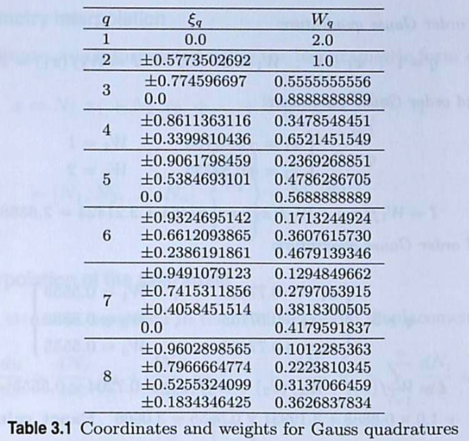

# Fortran 輪講
### 目次
- [積分](#積分_2022)
- [テンソル解析](#テンソル解析)
### 資料
- [Notion](https://www.notion.so/Fortran-31ead3c007d180e384e5ecc3ac002fac)
- [Fortran 入門](https://www.nag-j.co.jp/fortran/index.html)

## 積分_2022
1. √a を「計算して」求めるプログラムの作成

	> ヒント：Taylor展開，Newton法

2.  円周率 π を「計算して」求めるプログラムの作成

	> ヒント：Taylor展開，モンテカルロ法，円の面積など

3. ガウス求積

	今，[-1,+1]の区間で関数 $f(\xi)$ を積分したい．
	$$I = \int_{-1}^{+1} f(\xi)d\xi$$
	このとき，Gauss求積を使うことを考える．

	Gauss求積とは，規定されている点における関数の値と規定されている重みの積を点の個数にわたって和をとることで積分の近似値を求める方法である．数式で表すと以下のようになる．
	$$I ≈ I_q = \sum_{i = 1}^q f(\xi_i)W_i$$
	> $I$ ：関数の積分値
	>
	> $I_q$ ：Gauss求積による積分値
	>
	> $\xi_i$：規定されている点
	>（求積点，Gauss点，サンプリング点などとも呼ぶ，表参照）
	>
	> $W_i$：規定されている重み（表参照）
	>
	> q ：求積点の個数（次数とも呼ぶ，表参照）

	[-1,+1]の領域で積分するとき求積点 $\xi_i$ および重み $W_i$ は次の表のように決まっている．
	
	[https://keio.app.box.com/file/439878617650]

	以下のような4次関数を[-1,+1]で積分する．
	$$f(x) = 1+x+x^2+x^3+x^4$$
	(1) 手計算にて積分値 $I$ を求めなさい．

	(2) Gauss求積を使って1次，2次，3次，4次の積分値 $I_1$ ~ $I_4$ を求めるプログラムを作成し，作成したプログラムで4つの積分値 $I_q$ を求めなさい．

	(3) 1.の手計算による積分値と2.のGauss求積で得られた積分値とを比較し，その精度を考察しなさい．

	> ヒント：サブルーチンを使うと書きやすい

## テンソル解析
> 条件：使用言語は Fortran
